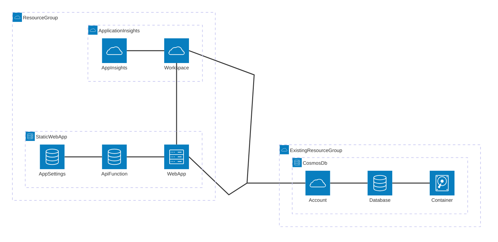

# Portfolio-Website

[🌐 _Visit My Portfolio Site_](https://www.ericslutz.dev/)

## Overview

A personal portfolio and playground for testing and showcasing full-stack solutions. This project is designed to showcase my work and to experiment with a variety of modern technologies. It features a front-end, API, and cloud-native deployment using Azure resources and Infrastructure-as-Code.

## Content Overview

- **Projects Showcase**: Explore a curated list of personal and professional projects, each with detailed descriptions, technologies used, and links to source code or live demos.
- **Achievements & Recognitions**: Highlighted awards, honors, and notable recognitions received throughout your career and education.
- **Education**: Overview of academic background, degrees, certifications, and relevant coursework.
- **Certifications**: Display of earned professional certifications, including details and verification links where available.
- **Work Experience**: Summaries of key roles, responsibilities, and accomplishments from your professional journey.
- **Contact & Social Links**: Easy access to contact information and links to social profiles for networking and collaboration.

## Features

- **Dynamic & Up-to-date Content**: All sections are powered by a backend API and database, allowing for real-time updates and easy content management.
- **Modern Angular Frontend**: Responsive, component-based UI for a seamless user experience.
- **Serverless API (Azure Functions)**: Scalable backend endpoints for portfolio data.
- **Content Management via Azure Cosmos DB**: Fast, reliable, and globally distributed data storage.
- **Observability with Application Insights**: Integrated monitoring and telemetry for performance and reliability.
- **Automated Workflows & CI/CD**: GitHub Actions automate build, test, deployment, and infrastructure provisioning for both frontend and backend, ensuring consistent and reliable releases.
- **Infrastructure-as-Code (Bicep)**: All Azure resources are defined and managed using Bicep templates for repeatable, version-controlled deployments.
- **Global Distribution & Security**: Hosted on Azure Static Web Apps for fast, secure, and globally available access, with built-in authentication options.
- **Custom Domain & DNS Management**: Supports custom domains with DNS configuration and management for a professional, branded web presence.

## Tech Stack

Angular

A modern front-end framework for building dynamic, modular single-page applications. Used here to create the portfolio's UI with a component-based architecture and built-in routing.

TypeScript

A statically typed superset of JavaScript that improves code quality and maintainability. Used throughout the Angular app for type safety and modern language features.

HTML/CSS

The core web technologies for content structure and styling. Used to build a responsive, accessible, and visually appealing user interface.

C#

A modern programming language used for the backend API. Powers the Azure Function to provide a serverless endpoint for dynamic data retrieval.

Bicep

A domain-specific language for Infrastructure-as-Code on Azure. Used to define and provision all required Azure resources in a repeatable, version-controlled way.

Azure Static Web Apps

A managed Azure service that hosts the Angular frontend and integrates with Azure Functions. Provides global distribution, authentication, and CI/CD integration.

Azure Functions

A serverless compute service for running backend logic in response to HTTP requests. Used to implement the API endpoints in C#.

Azure Cosmos DB

A globally distributed NoSQL database service. Used to store and serve portfolio content such as projects and education data.

Azure Application Insights

A monitoring and observability service for collecting telemetry and diagnosing issues. Used to track performance and health of the backend API.

GitHub Actions

A CI/CD platform for automating build, test, and deployment workflows. Used to deploy both frontend and backend to Azure and manage infrastructure provisioning.

## Architecture

## Project Structure

- `src/` – Angular frontend application
- `api/` – Azure Functions backend (C#)
- `iac/` – Infrastructure-as-Code (Bicep) for Azure resource provisioning
- `staticwebapp.config.json` – Configuration for Azure Static Web Apps

---

> [!NOTE]
> This repository is for personal use and demonstration purposes only. The code is not intended for reuse, redistribution, or deployment by others.
